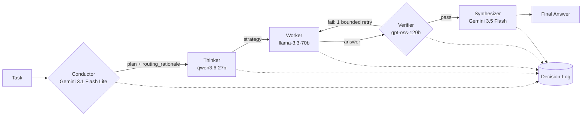

# Maestro

**Frontier-quality answers from free models, through transparent orchestration.**

Maestro is a glass-box, open-source rebuild of the Fugu / TRINITY concept: a **Conductor**
model reads a task, assigns **Thinker / Worker / Verifier** roles across a pool of *free*
LLMs, and synthesizes one high-quality answer — **showing its work at every step**.

The pitch isn't cost-saving (the models are already free). It's that **intelligent
orchestration beats raw model size** — proven by Sakana's TRINITY (86.2% pass@1 on
LiveCodeBench) and Mixture-of-Agents (65.8% vs GPT-4o's 57.5% on AlpacaEval 2.0), and
rebuilt here open and transparent so anyone can run it.

> **Honest disclosure:** Maestro's conductor is **prompt/rule-based, not a trained
> coordinator** like Fugu's <20K-parameter evolved model. This is an honest re-creation of
> the *concept*, not the trained artifact.

[](https://github.com/Harshith29124/Maestro/actions/workflows/ci.yml)


---

## Architecture



Every step appends to a **structured decision-log** — the differentiator Fugu can't offer.
The verifier is always a *different model family* than the worker (mitigating the 10–25%
self-preference bias in LLM-as-judge).

---

## Quickstart

```bash
git clone https://github.com/Harshith29124/Maestro.git && cd Maestro
pip install -r requirements.txt
cp .env.example .env          # add free GROQ_API_KEY + GOOGLE_API_KEY (or leave blank for mock mode)

# CLI
python cli.py "Write a Python LRU cache" --mode conductor

# Web dashboard + API
uvicorn api.main:app --reload   # then open http://localhost:8000
```

**No API keys?** Maestro ships with a deterministic **mock provider** (`MAESTRO_ALLOW_MOCK=true`),
so the full flow — plan parsing, verifier verdicts, dashboard, tests — runs offline. Add real
free keys ([Groq](https://console.groq.com), [Google AI Studio](https://aistudio.google.com/apikey))
for real output.

---

## Modes

| Mode | Flow | Use |
|------|------|-----|
| **conductor** (default) | conductor → thinker → worker → verifier → (retry) → synthesizer | Best quality-per-call; the primary pattern |
| **consensus** (MoA-lite) | N parallel proposers → aggregator | Diversity; capped to protect TPM |
| **single** | one model | Honest baseline for benchmarks |

---

## The decision-log (the product)

Every run emits a complete, replayable JSON log (`GET /runs/{id}` or the dashboard's export
button):

```json
{
  "run_id": "uuid",
  "mode": "conductor",
  "plan": {"task_type": "coding", "difficulty": "medium", "routing_rationale": "why..."},
  "steps": [
    {"step": "conductor", "model": "gemini-3.5-flash", "routing_rationale": "...", "tokens": {"in": 0, "out": 0}, "latency_ms": 0},
    {"step": "verify", "model": "openai/gpt-oss-120b", "verdict": "pass", "issues": []}
  ],
  "final_answer": "...",
  "verification_status": "verified",
  "totals": {"calls": 5, "tokens": 719, "wall_ms": 0, "fallbacks": []}
}
```

---

## Free-tier rate-limit handling

TPM — not RPM — is the binding constraint on Groq's free tier (gpt-oss = **8K TPM**). Maestro
handles this in `maestro/ratelimit.py`:

- **Per-model token-bucket** enforcing both RPM *and* TPM over a rolling 60s window, reserving
  estimated tokens *before* a call so we defer rather than 429.
- **Exponential backoff with jitter** on HTTP 429, honoring the provider's `Retry-After`.
- **Model fallback chains** per role, diversified across families (Thinker `qwen3.6-27b →
  gpt-oss-120b`; Worker `llama-3.3-70b → qwen3.6-27b → gpt-oss-20b`; Verifier kept a *different*
  family than the Worker). Configured in `config.yaml`; long-context steps route to Gemini
  (~1M TPM) to spare Groq's tight budget. Worker auto-falls to qwen after llama's Aug 16 2026 shutdown.
- **Continue-on-fail:** one failed model call never crashes a run — it's logged and the
  orchestrator proceeds with partial results.

Swap models by editing **`config.yaml` only** — orchestration code never hard-codes a model ID.
(The Groq catalog rotates fast: the Llama pair shuts down Aug 16, 2026; the durable set is pinned.)

---

## Security & deployment

Built to deploy publicly on **Railway** or **Vercel** without leaking your free quota. The
security layer (`api/security.py`) provides:

- **API-key auth** (`X-API-Key` / `Authorization: Bearer`), constant-time compared. Set
  `MAESTRO_API_KEYS` to enable.
- **Per-client rate limiting** (per-minute + per-day), separate from the provider-side throttle.
  In-memory by default; **set Upstash Redis env vars and it becomes globally consistent across
  all serverless instances** (see below) — the right answer for Vercel.
- **Security headers** on every response: CSP, `X-Frame-Options: DENY`, `X-Content-Type-Options`,
  `Referrer-Policy`, HSTS (in production).
- **Input hardening**: prompt length caps, control-character stripping, null-byte rejection,
  request-body size limits.
- **Strict CORS** (no wildcard with credentials) and **no internal error leakage**.
- **Startup self-audit**: in `MAESTRO_ENV=production`, Maestro logs warnings for unauthenticated
  APIs, wildcard CORS, mock mode left on, or a missing secret key.

### Deploy on Vercel (primary path)

`vercel.json` + `api/index.py` serve the ASGI app via `@vercel/python` (Python 3.11,
`maxDuration` 60s so multi-call orchestration isn't cut off).

```bash
npm i -g vercel
vercel            # link the project
vercel --prod     # deploy
```

Set these in the Vercel project **Environment Variables**:

```
MAESTRO_ENV=production
MAESTRO_API_KEYS=<generate strong keys>      # REQUIRED — keeps the API non-public
MAESTRO_CORS_ORIGINS=https://your-app.vercel.app
MAESTRO_ALLOW_MOCK=false
GROQ_API_KEY=...
GOOGLE_API_KEY=...
# Globally-consistent rate limiting across serverless instances (free Upstash tier):
UPSTASH_REDIS_REST_URL=...
UPSTASH_REDIS_REST_TOKEN=...
```

**Two serverless facts Maestro handles for you:**
- **No WebSockets** on Vercel serverless — the dashboard auto-detects this and falls back to
  the REST `/orchestrate` endpoint (the timeline renders all at once instead of streaming live).
- **Read-only filesystem** — run persistence auto-routes to a writable temp dir, and the full
  decision-log is always returned inline in the response, so `runs/` being read-only never
  breaks a run. `GET /runs/{id}` is best-effort on serverless (ephemeral per instance).

> **Why Upstash?** Without it, the rate limiter counts per-instance, and Vercel runs many
> instances — so a burst spread across instances can slip past your limit and burn your free
> provider quota. With Upstash set, counts are shared and the limit is enforced for real.
> `GET /health` reports `"rate_limit_backend": "upstash-redis"` once it's wired. The in-memory
> limiter stays on as a per-instance backstop in case Redis is briefly unreachable.

### Deploy on Railway (alternative — supports live WebSocket streaming)

Railway auto-detects the `Dockerfile` / `railway.json`. It's a single long-lived container, so
the in-memory limiter is globally accurate (no Upstash needed) and live WS streaming works. Set
the same env vars (minus Upstash). Note Railway's free trial is time-limited.

> See `.env.example` for every setting. **Before any public deploy:** set `MAESTRO_API_KEYS`,
> set explicit `MAESTRO_CORS_ORIGINS`, and `MAESTRO_ALLOW_MOCK=false`.

---

## Benchmarks (honest)

```bash
python benchmarks/run_bench.py        # conductor vs single, held-out judge, randomized order
```

The harness reports a win-rate **plus token/latency cost — including where orchestration
doesn't help**. (Run with real keys; mock-provider numbers are illustrative only.) Orchestration
doesn't always win: multi-agent debate often fails to beat single-model + self-consistency, and
judges are biased — so the benchmark is designed to report that honestly rather than inflate it.

---

## Project layout

```
maestro/
├── config.yaml              # model pool, role chains, RPM/TPM limits — the only file you edit to swap models
├── maestro/
│   ├── conductor.py         # plan + routing_rationale (with safe fallback parsing)
│   ├── orchestrator.py      # the flow; mode switch (conductor/consensus/single)
│   ├── ratelimit.py         # token-bucket RPM+TPM limiter, backoff, fallback chain
│   ├── decision_log.py      # schema export + persistence
│   ├── schemas.py           # pydantic models (the shared contract)
│   ├── security.py          # input hardening
│   ├── roles/               # thinker, worker, verifier, synthesizer
│   └── providers/           # groq (OpenAI-compatible), gemini (REST), mock
├── api/
│   ├── main.py              # FastAPI: /orchestrate, /runs/{id}, WS /ws/orchestrate
│   └── security.py          # auth, rate limiting, headers, CORS
├── dashboard/               # vanilla HTML/CSS/JS editorial dashboard
├── benchmarks/              # honest eval set + harness
├── n8n/maestro_workflow.json # importable workflow mirroring the same flow
└── tests/                   # pytest, runs offline on the mock provider
```

The Conductor→Roles flow lives once in `orchestrator.py` and is mirrored node-for-node in the
n8n workflow; both emit the **identical decision-log schema** so the dashboard works against either.

---

## Tests

```bash
pip install -r requirements-dev.txt   # test tooling (pytest, respx)
pytest -q                             # 21 tests, fully offline via the mock provider
```

---

## Credits & honesty

- Concept: Sakana's [TRINITY](https://sakana.ai/trinity/) (Thinker/Worker/Verifier) and Fugu's learned Conductor.
- Evidence base: Mixture-of-Agents (arXiv:2406.04692), self-consistency (arXiv:2203.11171), LLM-as-judge bias (arXiv:2410.21819).
- Maestro's conductor is **prompt/rule-based**, not a trained model. Google may use free-tier
  Gemini prompts for training — don't send sensitive data through the free tier.

MIT licensed.
