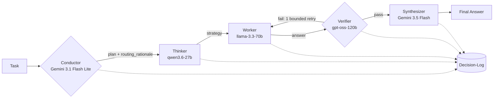

# Maestro

**Frontier-quality answers from free models, through transparent orchestration.**

[**Live demo**](https://maestro-psi-neon.vercel.app/) · [Architecture](#architecture) · [Decision-log](#the-decision-log-the-product) · [Benchmarks](#benchmarks-honest)

Built by [**Harshith Nayaka L**](https://harshith-nayaka-l-portfolio.vercel.app/) — AI Engineer, Full-Stack, Bengaluru, India.

Maestro is a glass-box, open-source rebuild of the Fugu / TRINITY concept: a **Conductor**
model reads a task, assigns **Thinker / Worker / Verifier** roles across a pool of *free*
LLMs, and synthesizes one high-quality answer — **showing its work at every step**.

The pitch isn't cost-saving (the models are already free). It's that **intelligent
orchestration beats raw model size** — proven by Sakana's TRINITY (86.2% pass@1 on
LiveCodeBench) and Mixture-of-Agents (65.8% vs GPT-4o's 57.5% on AlpacaEval 2.0), and
rebuilt here open and transparent so anyone can run it.

> **Honest disclosure:** Maestro's conductor is **prompt/rule-based, not a trained
> coordinator** like Fugu's <20K-parameter evolved model. This is an honest re-creation of
> the *concept*, not the trained artifact.

[](https://github.com/HarshithNayakaL/Maestro/actions/workflows/ci.yml)


---

## Architecture


```mermaid
flowchart LR
    T[Task] --> C{Conductor<br/>Gemini 3.1 Flash Lite}
    C -->|plan + routing_rationale| TH[Thinker<br/>qwen3.6-27b]
    TH -->|strategy| W[Worker<br/>llama-3.3-70b]
    W -->|answer| V{Verifier<br/>gpt-oss-120b}
    V -->|pass| S[Synthesizer<br/>Gemini 3.5 Flash]
    V -->|fail: 1 bounded retry| W
    S --> A[Final Answer]
    C -.-> LOG[(Decision-Log)]
    TH -.-> LOG
    W -.-> LOG
    V -.-> LOG
    S -.-> LOG
```

Every step appends to a **structured decision-log** — the differentiator Fugu can't offer.
The verifier is always a *different model family* than the worker (mitigating the 10–25%
self-preference bias in LLM-as-judge).

---

## Quickstart

```bash
git clone https://github.com/HarshithNayakaL/Maestro.git && cd Maestro
pip install -r requirements.txt
cp .env.example .env          # add free GROQ_API_KEY + GOOGLE_API_KEY (or leave blank for mock mode)

# CLI
python cli.py "Write a Python LRU cache" --mode conductor

# Web dashboard + API
uvicorn api.main:app --reload   # then open http://localhost:8000
```

**No API keys?** Maestro ships with a deterministic **mock provider** (`MAESTRO_ALLOW_MOCK=true`),
so the full flow — plan parsing, verifier verdicts, dashboard, tests — runs offline. Add real
free keys ([Groq](https://console.groq.com), [Google AI Studio](https://aistudio.google.com/apikey))
for real output.

---

## Modes

| Mode | Flow | Use |
|------|------|-----|
| **conductor** (default) | conductor → thinker → worker → verifier → (retry) → synthesizer | Best quality-per-call; the primary pattern |
| **consensus** (MoA-lite) | N parallel proposers → aggregator | Diversity; capped to protect TPM |
| **single** | one model | Honest baseline for benchmarks |

---

## The decision-log (the product)

Every run emits a complete, replayable JSON log (`GET /runs/{id}` or the dashboard's export
button):

```json
{
  "run_id": "uuid",
  "mode": "conductor",
  "plan": {"task_type": "coding", "difficulty": "medium", "routing_rationale": "why..."},
  "steps": [
    {"step": "conductor", "model": "gemini-3.5-flash", "routing_rationale": "...", "tokens": {"in": 0, "out": 0}, "latency_ms": 0},
    {"step": "verify", "model": "openai/gpt-oss-120b", "verdict": "pass", "issues": []}
  ],
  "final_answer": "...",
  "verification_status": "verified",
  "totals": {"calls": 5, "tokens": 719, "wall_ms": 0, "fallbacks": []}
}
```

---

## Free-tier rate-limit handling

TPM — not RPM — is the binding constraint on Groq's free tier (gpt-oss = **8K TPM**). Maestro
handles this in `maestro/ratelimit.py`:

- **Per-model token-bucket** enforcing both RPM *and* TPM over a rolling 60s window, reserving
  estimated tokens *before* a call so we defer rather than 429.
- **Exponential backoff with jitter** on HTTP 429, honoring the provider's `Retry-After`.
- **Model fallback chains** per role, diversified across families (Thinker `qwen3.6-27b →
  gpt-oss-120b`; Worker `llama-3.3-70b → qwen3.6-27b → gpt-oss-20b`; Verifier kept a *different*
  family than the Worker). Configured in `config.yaml`; long-context steps route to Gemini
  (~1M TPM) to spare Groq's tight budget. Worker auto-falls to qwen after llama's Aug 16 2026 shutdown.
- **Continue-on-fail:** one failed model call never crashes a run — it's logged and the
  orchestrator proceeds with partial results.

Swap models by editing **`config.yaml` only** — orchestration code never hard-codes a model ID.
(The Groq catalog rotates fast: the Llama pair shuts down Aug 16, 2026; the durable set is pinned.)

---

## Security & deployment

Built to deploy publicly on **Railway** or **Vercel** without leaking your free quota. The
security layer (`api/security.py`) provides:

- **API-key auth** (`X-API-Key` / `Authorization: Bearer`), constant-time compared. Set
  `MAESTRO_API_KEYS` to enable.
- **Per-client rate limiting** (per-minute + per-day), separate from the provider-side throttle.
  In-memory by default; **set Upstash Redis env vars and it becomes globally consistent across
  all serverless instances** (see below) — the right answer for Vercel.
- **Security headers** on every response: CSP, `X-Frame-Options: DENY`, `X-Content-Type-Options`,
  `Referrer-Policy`, HSTS (in production).
- **Input hardening**: prompt length caps, control-character stripping, null-byte rejection,
  request-body size limits.
- **Strict CORS** (no wildcard with credentials) and **no internal error leakage**.
- **Startup self-audit**: in `MAESTRO_ENV=production`, Maestro logs warnings for unauthenticated
  APIs, wildcard CORS, mock mode left on, or a missing secret key.

### Deploy on Vercel (primary path)

`vercel.json` + `api/index.py` serve the ASGI app via `@vercel/python` (Python 3.11,
`maxDuration` 60s so multi-call orchestration isn't cut off).

```bash
npm i -g vercel
vercel            # link the project
vercel --prod     # deploy
```

Set these in the Vercel project **Environment Variables**:

```
MAESTRO_ENV=production
MAESTRO_API_KEYS=<generate strong keys>      # REQUIRED — keeps the API non-public
MAESTRO_CORS_ORIGINS=https://your-app.vercel.app
MAESTRO_ALLOW_MOCK=false
GROQ_API_KEY=...
GOOGLE_API_KEY=...
# Globally-consistent rate limiting across serverless instances (free Upstash tier):
UPSTASH_REDIS_REST_URL=...
UPSTASH_REDIS_REST_TOKEN=...
```

**Two serverless facts Maestro handles for you:**
- **No WebSockets** on Vercel serverless — the dashboard auto-detects this and falls back to
  the REST `/orchestrate` endpoint (the timeline renders all at once instead of streaming live).
- **Read-only filesystem** — run persistence auto-routes to a writable temp dir, and the full
  decision-log is always returned inline in the response, so `runs/` being read-only never
  breaks a run. `GET /runs/{id}` is best-effort on serverless (ephemeral per instance).

> **Why Upstash?** Without it, the rate limiter counts per-instance, and Vercel runs many
> instances — so a burst spread across instances can slip past your limit and burn your free
> provider quota. With Upstash set, counts are shared and the limit is enforced for real.
> `GET /health` reports `"rate_limit_backend": "upstash-redis"` once it's wired. The in-memory
> limiter stays on as a per-instance backstop in case Redis is briefly unreachable.

### Deploy on Railway (alternative — supports live WebSocket streaming)

Railway auto-detects the `Dockerfile` / `railway.json`. It's a single long-lived container, so
the in-memory limiter is globally accurate (no Upstash needed) and live WS streaming works. Set
the same env vars (minus Upstash). Note Railway's free trial is time-limited.

> See `.env.example` for every setting. **Before any public deploy:** set `MAESTRO_API_KEYS`,
> set explicit `MAESTRO_CORS_ORIGINS`, and `MAESTRO_ALLOW_MOCK=false`.

---

## Benchmarks (honest)

```bash
python benchmarks/run_bench.py        # conductor vs single, held-out judge, randomized order
```

### What it measures

`benchmarks/tasks.jsonl` holds eight tasks across four types: three reasoning problems
(including the bat-and-ball trap and "17 sheep, all but 9 run away" — both designed to catch
a model that pattern-matches instead of parsing), three coding problems (iterative Fibonacci
in O(1) space, palindrome normalization, an O(1)-average LRU cache), one writing task and one
analysis task. The set is small on purpose: every task has either a checkable right answer or
a clear failure mode, so a win is legible rather than a vibe.

Each task runs through **conductor** mode and **single** mode, and a held-out judge picks the
better answer.

### What it controls for

- **Position bias** — A/B order is randomized per task and the swap is unwound before scoring,
  so a judge that habitually prefers whichever answer it saw first cannot manufacture a win.
- **Self-preference** — the judge runs on the verifier chain, a different model family from
  the worker that produced the conductor-mode answer.

### What it reports

Win / loss / tie **and** the token and wall-clock cost of both modes, because the honest
question is not "did orchestration win" but "did it win by enough to justify five model calls
instead of one". Orchestration does not always win — multi-agent debate frequently fails to
beat a single model with self-consistency — and this harness is built to report that rather
than bury it.

Run it with real keys. Under the mock provider the outputs are deterministic fixtures, so the
numbers are illustrative only and shouldn't be quoted as results.

---

## Project layout

```
maestro/
├── config.yaml              # model pool, role chains, RPM/TPM limits — the only file you edit to swap models
├── maestro/
│   ├── conductor.py         # plan + routing_rationale (with safe fallback parsing)
│   ├── orchestrator.py      # the flow; mode switch (conductor/consensus/single)
│   ├── ratelimit.py         # token-bucket RPM+TPM limiter, backoff, fallback chain
│   ├── decision_log.py      # schema export + persistence
│   ├── schemas.py           # pydantic models (the shared contract)
│   ├── security.py          # input hardening
│   ├── roles/               # thinker, worker, verifier, synthesizer
│   └── providers/           # groq (OpenAI-compatible), gemini (REST), mock
├── api/
│   ├── main.py              # FastAPI: /orchestrate, /runs/{id}, WS /ws/orchestrate
│   └── security.py          # auth, rate limiting, headers, CORS
├── dashboard/               # vanilla HTML/CSS/JS editorial dashboard
├── benchmarks/              # honest eval set + harness
├── n8n/maestro_workflow.json # importable workflow — the same flow, minus the verifier (see below)
└── tests/                   # pytest, runs offline on the mock provider
```

`orchestrator.py` is the source of truth for the flow. The n8n workflow is a partial mirror of
it — see below for exactly which parts.

### Running the flow in n8n

`n8n/maestro_workflow.json` imports directly (**Workflows → Import from File**): a webhook takes
`{task}`, a Set node holds the model IDs, and the chain runs conductor → thinker → worker →
synthesizer over the same Groq and Gemini free tiers. Set `GROQ_API_KEY` and `GOOGLE_API_KEY` as
n8n environment variables and it runs against the same pool as the Python service.

It exists because "orchestration" means two different things to two audiences — a Python service
to engineers, a visual canvas to operations teams — and the architecture should survive both
framings.

**What the n8n version does not do**, so nobody imports it expecting parity:

- **No verifier and no retry branch.** The Python orchestrator routes the worker's answer through
  a different-family verifier and re-runs the worker once on a fail verdict. The n8n chain goes
  straight from worker to synthesizer, so nothing is checked before it is polished.
- **No decision-log.** The webhook responds with `final_answer` and `mode` only. The step-level
  model/token/latency records that the dashboard reads come from the Python path.
- **Fixed 2-second waits instead of a token bucket.** `ratelimit.py` reserves estimated tokens
  before each call and defers precisely; n8n just sleeps between the Groq calls. It is a blunt
  guard that works on a small free tier and would not survive real throughput.

Bringing the two to parity means adding the verifier node with its IF-branch retry and building
the log object across nodes — worth doing, not done yet.

---

## Tests

```bash
pip install -r requirements-dev.txt   # test tooling (pytest, respx)
pytest -q                             # 28 tests, fully offline via the mock provider
```

No keys, no network: the mock provider makes the whole suite deterministic, covering the
orchestrator's mode switch, the RPM/TPM limiter, output cleaning, the API surface, and the
security layer (auth, rate limiting, headers, input hardening).

---

## Credits & honesty

- Concept: Sakana's [TRINITY](https://sakana.ai/trinity/) (Thinker/Worker/Verifier) and Fugu's learned Conductor.
- Evidence base: Mixture-of-Agents (arXiv:2406.04692), self-consistency (arXiv:2203.11171), LLM-as-judge bias (arXiv:2410.21819).
- Maestro's conductor is **prompt/rule-based**, not a trained model. Google may use free-tier
  Gemini prompts for training — don't send sensitive data through the free tier.

MIT licensed.

---

## Author

**Harshith Nayaka L** — AI Engineer, Full-Stack, based in Bengaluru (Bangalore), India.

I build LLM systems end to end: agent and orchestration architecture, the retrieval and
rate-limit plumbing underneath it, and the APIs and interfaces on top.

- Portfolio and case studies — https://harshith-nayaka-l-portfolio.vercel.app/
- Full write-up of this project — https://harshith-nayaka-l-portfolio.vercel.app/work/maestro
- GitHub — https://github.com/HarshithNayakaL
- LinkedIn — https://www.linkedin.com/in/harshithnayakal

**Related work:** [Cannon](https://github.com/HarshithNayakaL/cannon-multi-agents) is the
deliberate opposite of this repo — independent domain specialists that never share context,
where Maestro splits a single task across roles that must collaborate. Same infrastructure
problems, opposite architectural answer.
